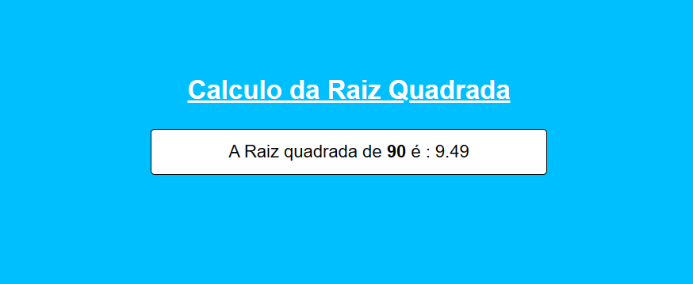
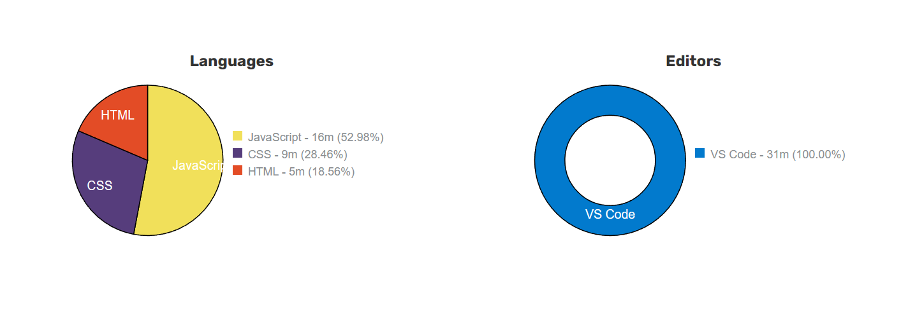

# Projeto-Intermediário-JavaScritp-07
O Projeto aqui é do nível <b>Intermediário</b>, utilizando HTML/CSS e JavaScritp

 
    
    
              

#

#06 Calculo da Raiz Quadrada

O Scritp irar receber os dados do user e em seguida realizar os calculos para depois exibir o resultado na tela, nesse programa foi utilizado algumas funções como:

- Variaveis
- getElementById("")
- prompt
- Number()
- function

#

    

#

# Coding Time

    

